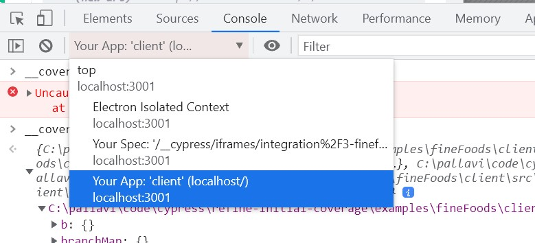
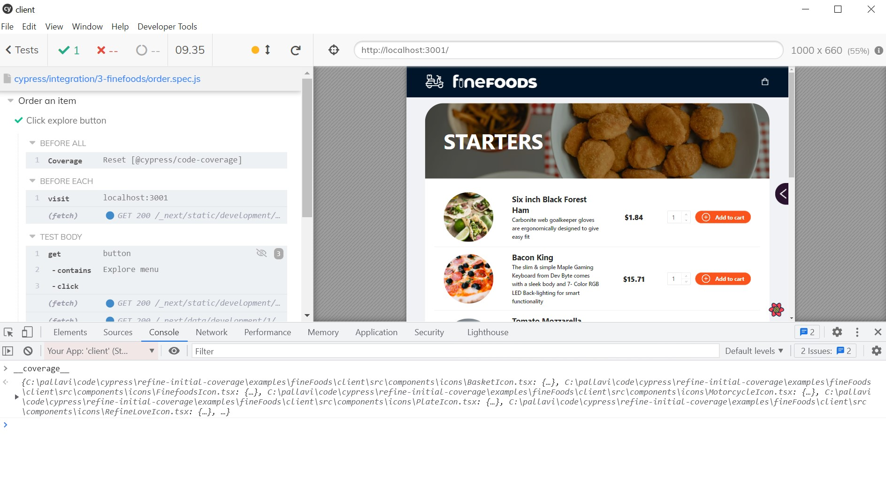
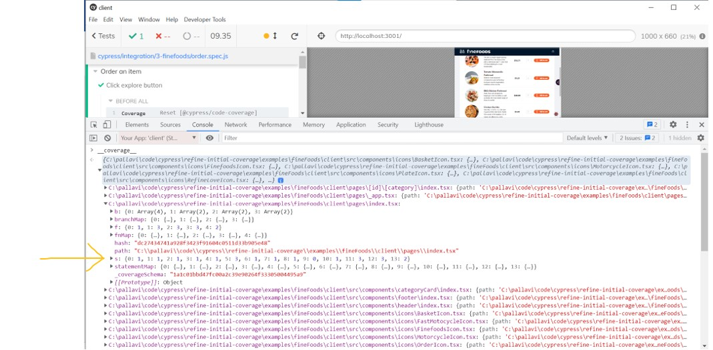
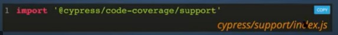
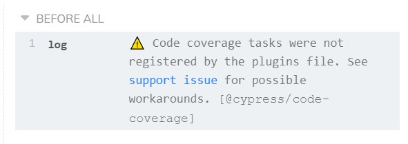
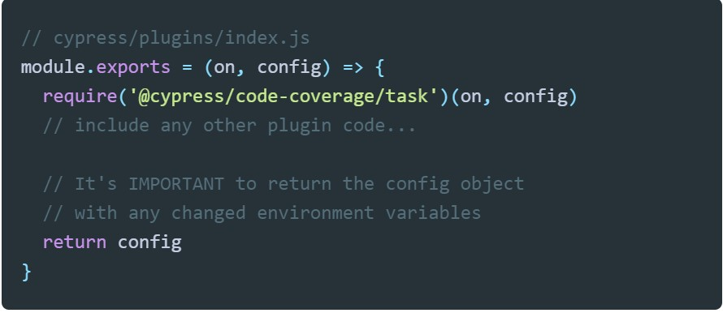
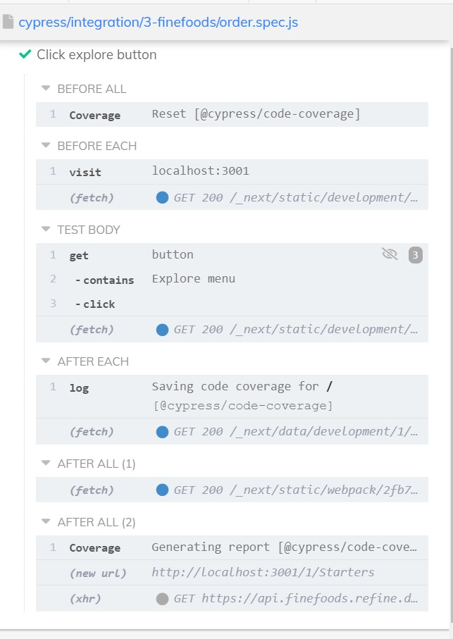
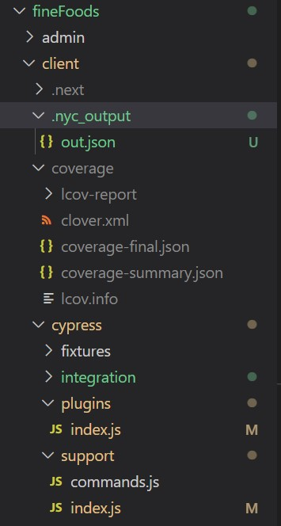
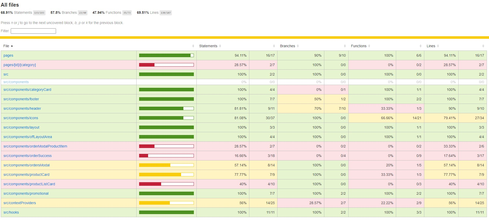

# Setting up code coverage with Cypress and Next.js on a repo

I am writing tests for an open source application in [this](https://github.com/pramam/refine) repo, forked from [github.com/pankod/refine](https://github.com/pankod/refine).

The tests are being written for an example app in this repo, fineFoods. fineFoods is a restaurant delivery app with a client and an admin application. One can place orders from a menu in the client app, and the admin app allows one to accept the order, process it and deliver it.

The client app and the admin app can be seen [here](https://refine.dev/demo/).

Here's a live version of the client app: [https://example.refine.dev/](https://example.refine.dev/).
Here's a live version of the admin app: [https://example.admin.refine.dev/](https://example.admin.refine.dev/).

Watch [this](https://youtu.be/C8g5X4vCZJA) video in the [cypress documentation](https://docs.cypress.io/guides/tooling/code-coverage) to get context on how to get started. Specifically, we need to:
- instrument the code
- run cypress tests
- see code coverage results

All commands below are run in the directory `<repo>/examples/fineFoods/client`

## Instrumenting the client to show Cypress code coverage

1. run `npm install` and then run `npm run start` to make sure the client application comes up.
2. install cypress 

   $npm install cypress --save-dev
2. Run `npx cypress open` to make sure the example tests run.
3. The sample cypress tests automatically installed by cypress go to a different application outside of the "refine" repo. So it is not possible to instrument that code. We'll have to write a test. Here's a simple test on the refine fineFoods client application:
```
//cypress/integration/3-finefoods/order.spec.js
/// <reference types="cypress" />
describe("Order an item", () => {
    beforeEach(() => {
        cy.visit("localhost:3001");
    });
    it("Click explore button", () => {
        cy.get("button").contains("Explore menu").click();
    });
});
```
4. Run `npx cypress open`. This will bring up a cypress window, run the test 3-finefoods/order.spec.js to make sure the test passes.
5. Add the `istanbul` instrumenting plugin to `./babelrc`:
```
    {
        "presets": [
          "next/babel"
        ],
        "plugins": [
           [
            "import",
            {
                "libraryName": "antd",
                "style": true
            }
           ],
           "istanbul"
       ]
    }
```
6. Install the `istanbul` [plugin] (https://github.com/istanbuljs/babel-plugin-istanbul)

   $npm install --save-dev babel-plugin-istanbul
7. Now we need to check that our cypress test is instrumented. After you run the cypress test, in the window in which the Cypress test ran, open dev tools -> Console and select `Your App` as in the picture below:


8. In the console, type `__coverage__` and you should see a coverage object. In the above picture, you can see it underneath the drop down. I didn't save that when doing it, and here is a snapshot from a later point in this exercise:


And expanded:



So, now we've confirmed that our code is instrumented.

## Seeing code coverage results

1. We need to use `@cypress/code-coverage` plugin to generate reports. This saves `__coverage__` from Cypress end-to-end and unit tests. Run the following command. nyc helps us consolidate the reports and it needs istanbul-lib-coverage.

`$npm i -D @cypress/code-coverage nyc istanbul-lib-coverage`

2. In `cypress/support/index.js` add the following:



3. At this point, you will see the following in the cypress window that runs the tests:


4. Add the following to `cypress/plugins/index.js`. 
Note that this is different from what the video does.


5. Restart cypress for this to be picked up. No need to restart the fineFoods client app.

6. Now, on running the test you will see the following.
Note the BEFORE All Coverage, AFTER EACH log, and AFTER ALL Coverage. This tells us that the coverage data is being saved.


7. You will now see a `.nyc_output` and `coverage` directories in `<repo>/examples/fineFoods/client`.


8. Now, open `<repo>/examples/fineFoods/client/coverage/lcov-report/index.html` and here's the ouput:


We have 68.91% code coverage with a single click in our test!

9. The endeavor from here on out is to get this to 100% code coverage.

## Turning on instrumentation only for dev builds and not for production builds (on Windows)

1. To make sure the code is instrumented only in a test environment
remove `istanbul` from the `plugins` in `.babelrc` and add this to `.babelrc`:
```
{
    "env" : {
        "test": {
            "plugins": [ "istanbul"]
        }
    }
}
```
2. To run this, add the following command in `scripts` in `<repo>/examples/fineFoods/client/package.json`:
```
    "scripts": {
        "cy:open": "set NODE_ENV=test && cypress open",
    }
```
3. Now to run the cypress instrumentation in a test environment only, run `npm run cy:open`.